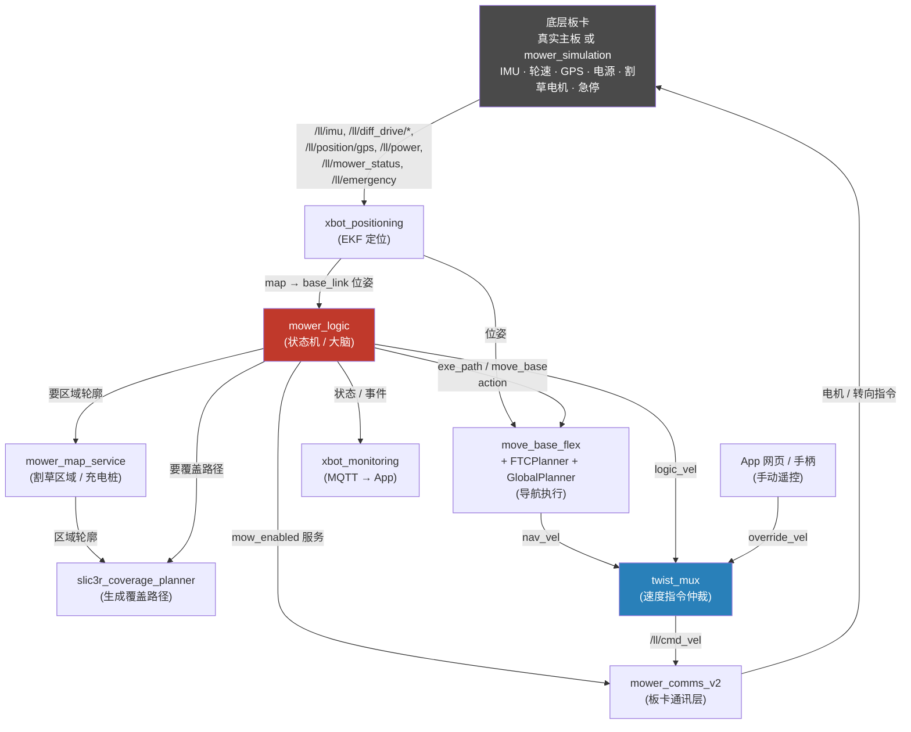

# 架构 / 运行流水线

这份文档说明这个仓库运行起来之后，数据是怎么在各个模块之间流动的，每个包具体负责什么，以及"割草地图"到底是怎么来的。想知道"改哪个包能影响什么"、"某个 topic 是谁发出来、谁在用"，看这份就够了。

想深挖某个具体模块——精确的话题/服务/参数清单、内部算法细节、代码行号引用——看 [modules-reference.md](modules-reference.md)。

## 一句话概述

这套软件把"割草机器人应该做什么"拆成几层：**底层板卡通讯**（读传感器、发电机指令）→ **定位**（算出机器人在地图里的位置）→ **地图与路径规划**（哪里能走、怎么铺满整块草坪）→ **决策**（`mower_logic` 这个状态机，决定现在该割草/回充/待命/录制地图）→ **导航执行**（把"该往哪走"变成实际的速度指令）→ **速度指令仲裁**（多个来源的速度指令谁优先）→ 传回底层板卡执行。App/网页监控和手动遥控是挂在这条主流水线两侧的旁支。

## 整体流水线



`mower_logic` 是整条流水线的"大脑"：它自己不算路径、不算定位，只是在合适的时机去问 `mower_map_service`"这块地长什么样"、问 `slic3r_coverage_planner`"怎么铺满它"、再把结果通过 action 交给 `move_base_flex` 去真正执行，同时通过 `mower_comms_v2` 的服务去开关割草电机。

## 各模块职责

### 底层通讯（跟"板卡"对话）

| 包 | 作用 |
| --- | --- |
| `mower_comms_v2` | 新版（Stage-2）主板的 ROS 接入层。通过 `xbot-service` 协议（`src/lib/xbot_framework`）跟真实主板或 `mower_simulation` 通信，把 IMU、轮速、GPS、电源、割草状态等发布到 `/ll/*` 话题，把 `/ll/cmd_vel`、割草电机开关等指令发下去。真实硬件和仿真对 ROS 层来说是同一套接口——这也是为什么仿真能复用几乎全部真实逻辑代码。 |
| `mower_comms_v1` / `xesc_ros` | 老款（V1）硬件的通讯路径：串口直连 xESC 电机控制器，不走 `xbot-service` 协议。仿真和新硬件都不用这条路。 |
| `mower_simulation` | 仿真出的"板卡"，实现跟真实主板一样的 `xbot-service` 各项 service（急停、差速驱动、割草、IMU、电源、GPS、固件版本查询等），让 `mower_comms_v2` 以为自己在跟真硬件说话。 |
| `mower_msgs` / `xbot_msgs` | 纯消息/服务定义包（`.msg`/`.srv`），没有可执行节点，给上面几个包共用。 |

### 定位

| 包 | 作用 |
| --- | --- |
| `xbot_positioning` | 扩展卡尔曼滤波（EKF）节点，融合 IMU、轮速里程计、GPS，输出机器人在地图坐标系里的位姿（`map` → `base_link` 的 TF，以及 `xbot_positioning/xb_pose`），供导航、状态机、以及下面讲的地图录制流程使用。 |
| `xbot_driver_gps` | 真实硬件用：u-blox GPS 接收机的底层驱动。仿真里由 `mower_simulation` 直接模拟出 GPS 数据，不需要这个包。 |
| `ros_ntrip_client` | 真实硬件用：连接 NTRIP 差分定位服务，把 RTCM 校正数据喂给 GPS，做到厘米级 RTK 定位精度。仿真不需要（`_ntrip_client.launch` 只在 `open_mower.launch` 里，不在仿真 launch 里）。 |

### 地图与路径规划

| 包 | 作用 |
| --- | --- |
| `mower_map` | 存取割草区域轮廓、导航区域、充电桩位置（存成 `map.json`），给别的模块提供查询/写入服务（`GetMowingArea`/`AddMowingArea`/`GetDockingPoint`/`SetDockingPoint` 等），也给导航的 costmap 提供静态地图层。这个包不做任何"造图"的工作，纯粹是个存取层——真正的图是下面"地图是哪来的"这一节描述的方式录出来的。 |
| `slic3r_coverage_planner` | 输入一块区域的轮廓，输出能铺满它的覆盖路径（往返条纹式路径，复用 Slic3r 3D 打印切片软件的填充算法）。只在开始割草时被 `mower_logic` 调用一次，不是持续运行的导航节点。 |

### 决策 / 状态机

| 包 | 作用 |
| --- | --- |
| `mower_logic` | 整个系统的核心状态机（`IDLE` / `MOWING` / `DOCKING` / `UNDOCKING` / `AREA_RECORDING` / `EMERGENCY` 等）。决定"现在该干什么"，向 `mower_map_service`/`slic3r_coverage_planner` 要数据，向 `move_base_flex` 发导航目标，向 `mower_comms_v2` 发割草电机开关指令，并把状态/事件上报给 `xbot_monitoring`。`/mower_service/high_level_control` 服务（Start/Dock/清急停/**进入地图录制模式**）就是外部（App 或命令行）跟这个状态机对话的入口。 |

### 导航执行

| 包 | 作用 |
| --- | --- |
| `move_base_flex`（`mbf_costmap_nav`，来自系统 ROS 包） | 导航执行框架，维护全局/局部 costmap，通过 action（`move_base` 点到点导航、`exe_path` 沿指定路径行驶）把目标变成实际的速度指令。 |
| `ftc_local_planner` | "Follow The Carrot" 局部规划器插件，装在 `move_base_flex` 里，负责按照给定路径尽量精确地跟随（覆盖路径、对接/脱离充电桩都靠它）。仓库自带的 melodic 版本，因为 README 里提到 noetic 官方版本当时不好用。 |
| `GlobalPlanner`（系统 ROS 包） | 在 costmap 上做全局路径规划，主要用在点到点导航（比如去/离开充电桩）而不是覆盖路径本身。 |

### 速度指令仲裁与输出

| 包 | 作用 |
| --- | --- |
| `twist_mux`（系统 ROS 包） | 把多个来源的速度指令（导航 `nav_vel`、`mower_logic` 自己发的 `logic_vel`、手动遥控的 `override_vel`）按优先级合并成唯一一路，输出到 `/ll/cmd_vel` 交给 `mower_comms_v2`。 |

### 监控与远程控制

| 包 | 作用 |
| --- | --- |
| `xbot_monitoring` | 把机器人状态、传感器数据、事件通过 MQTT（`ws://<host>:9001`）暴露给 OpenMowerApp 或其他监控系统（如 Home Assistant），也接收 App 发来的手动驱动指令（映射到 `/joy_vel`）。 |
| `xbot_remote` | 一个跑在 9002 端口的 WebSocket 服务器，给手机/浏览器上的摇杆做低延迟遥控，输出到 `/joy_vel`。跟 `xbot_monitoring` 是两条不同的手动控制入口，殊途同归都汇入 `twist_mux` 的 `override_vel`。 |
| `mower_utils` | 小工具节点集合，比如 `xbot_pose_converter`——把 `/ll/position/gps` 这种 GPS 位姿转换成标准的 `PoseStamped`，方便在 RViz 里直接显示。 |

### 遥控（手柄/键盘）

| 包 | 作用 |
| --- | --- |
| `joy` / `teleop_twist_joy` / `joy_teleop`（系统 ROS 包） | 本地接一个物理游戏手柄时用，把手柄输入转成 `/joy_vel` 速度指令，同样汇入 `twist_mux`。地图录制模式下，手柄的按键还会被 `mower_logic` 直接拿来当录制操作用（见下一节）。 |

### 基础框架

| 包 | 作用 |
| --- | --- |
| `xbot_framework` | `xbot-service` 协议的核心库 + 代码生成工具（`services/*.json` 定义 → 生成 C++ 的服务基类）。`mower_comms_v2`、`mower_simulation` 都是基于它构建各自的 service（急停、差速驱动、割草、GPS、`MetaService` 固件版本查询等）。改这套协议本身或加一个新 service，都要动这里的代码生成模板。 |
| `xbot_mqtt` | 通用的 MQTT-based RPC 库，`xbot_monitoring` 和 `mower_simulation`（`SimRpc`，给测试用的 `sim.dock.move`/`sim.battery.set` 等接口）都基于它实现。 |

## 地图是哪来的：首次建图 / 区域录制工作流

这里有个容易搞混的点：这个项目**没有**用激光雷达/视觉做传统意义上的 SLAM 建图。所谓"地图"（`map.json`，由 `mower_map` 存取）其实就是几个用 GPS 坐标描述的多边形（割草区域轮廓、区域内的障碍物、可通行但不割草的导航区域）加一个充电桩位姿——全部靠**人手动把机器人开一遍**录出来的，不存在"自动建图"这一步。

流程是（对应 `mower_logic` 里的 `AreaRecordingBehavior`，源码：`src/mower_logic/src/mower_logic/behaviors/AreaRecordingBehavior.cpp`）：

1. **从 `IDLE` 进入录制模式**：
   ```bash
   rosservice call /mower_service/high_level_control "command: 3"
   ```
   （App 里对应一个"进入地图编辑/录制"的入口；命令行的话，这跟前面讲的 `command: 1`/`2`/`254` 是同一个服务，`command: 3` = `COMMAND_S1`，触发 `mower_logic` 切到 `AREA_RECORDING` 状态。）

2. **手动把机器人开一圈**：用摇杆/手柄或 App 的手动驾驶功能，沿着割草区域的边界开一圈。开的过程中 `mower_logic` 不断读 `xbot_positioning/xb_pose`（也就是前面讲的 EKF 融合位姿），按"自动每移动一定距离记一个点"或者"手动按按钮记一个点"（手柄 RB 键）的方式，把机器人走过的轨迹变成一串多边形顶点。
   - 第一次录的多边形 = 这块地的**外轮廓**。
   - 同一块地里继续录第二个、第三个多边形 = 里面要绕开的**障碍物**（花坛、水池之类）。
3. **保存**：录完轮廓（+ 可选的障碍物）之后，选择保存成"割草区域"还是"导航区域"（能走但不割草），对应调用 `mower_map_service/add_mowing_area`，真正写进 `map.json`。也可以选择丢弃重录。
4. **录充电桩位置**：把机器人开到充电桩上，触发一次"记录充电桩位置"；再让机器人沿着离开充电桩的方向挪动一点，触发第二次——两次记录的坐标算出一个朝向，一起存成充电桩的完整位姿（`mower_map_service/set_docking_point`）。
5. **退出录制**，回到 `IDLE`。以后 `mower_logic` 启动割草时就是直接读这份录好的 `map.json`（外轮廓给 `slic3r_coverage_planner` 铺路径，障碍物在覆盖路径规划时被绕开，充电桩位姿用来算回充路径）。

`docker-simulation/data/ros/map.json` 就是仓库自带的一份录好的起始地图（有一块割草区域和一个充电桩），本地/Docker 仿真默认都是拿这份现成的，不需要你手动录一遍——只有你想换一块新地图、或者接真实机器人第一次用的时候才要走这个流程。

## 从开机到割草的一次完整流程

（假设地图已经录好，走的是上一节最后提到的现成 `map.json`。）

1. `mower_comms_v2` 连上底层板卡（真实或仿真），开始持续发布 `/ll/*` 数据。
2. `xbot_positioning` 拿到 IMU/轮速/GPS，跑 EKF，输出机器人的实时位姿。
3. `mower_logic` 启动后先进 `IDLE`，等 GPS 稳定、等 `xbot_positioning` 报告位姿正常。
4. 收到"开始割草"指令（`high_level_control` 服务的 `command: 1`，App 按钮或命令行都走这个）：
   - `mower_logic` 先向 `mower_map_service` 要当前要割的区域轮廓；
   - 交给 `slic3r_coverage_planner` 算出一条覆盖路径；
   - 通过 `mower_comms_v2` 的 `mow_enabled` 服务把割草电机打开；
   - 把覆盖路径交给 `move_base_flex` 的 `exe_path` action 去跟随（`ftc_local_planner` 负责具体的路径跟随控制）。
5. `move_base_flex` 算出的速度指令经过 `twist_mux`（这里优先级最高的通常是导航路径本身，除非有人在用手动遥控覆盖它）合并后，发到 `/ll/cmd_vel`。
6. `mower_comms_v2` 把这个速度指令转发给底层板卡（真实电机或 `mower_simulation`）去执行。
7. 全程 `xbot_monitoring` 把状态/事件同步给 App；如果触发急停或电池不足，`mower_logic` 会切到 `EMERGENCY`/`DOCKING` 状态，通过同一条链路把机器人送回充电桩。
