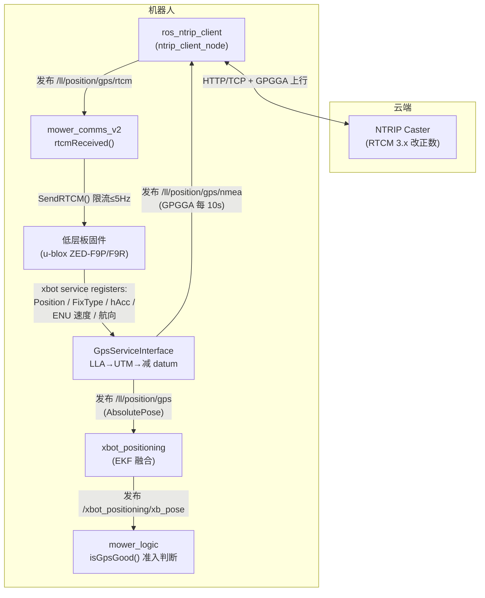

# RTK 定位原理

这份文档讲 OpenMower 的**定位精度是怎么来的**：RTK 差分定位的基本原理、从 NTRIP 差分数据到厘米级坐标的完整数据流、GPS 原始观测如何进入 `xbot_positioning` 的 EKF 融合、以及 RTK 失锁时系统如何降级。想先了解整体架构看 [architecture.md](architecture.md)，模块级的话题/参数清单看 [modules-reference.md](modules-reference.md)。

## 一句话概述
ansport of RTCM via Internet Protocol）**：通过互联网把 RTCM 从 caster（差分服务，如 rtk2go、千寻、本地基站）传给机器人。握手过程：客户端连上 caster → 发 NMEA `GPGGA` 报文告诉 caster 自己在哪里 → caster 据此返回 VRS（虚拟参考站）改正数。所以**上行自己的位置**是 NTRIP 协议的必要一环。
- 也有不用网络的方案：基站旁边挂一个数传电台，改正数走射频直接到机器人（配置里 `OM_USE_NTRIP=False` 就是这个意思）。

机器人上的 u-blox ZED-F9P/F9R 模块收到 RTCM 后做 RTK 解算，通过 `RXM-RTCM` 报文确认收到了改正数。

## 项目内的完整数据流

几个关键事实（行号对应代码）：

1. **NTRIP 客户端**（`_ntrip_client.launch:3-7`，包 `ros_ntrip_client`）只在真实硬件 launch（`open_mower.launch`）里启动，仿真不需要。启动条件：`_comms.launch:36-39` 要求 `OM_USE_NTRIP=True` 且未设 `OM_NO_GPS`。它订阅本机位置、发布 RTCM，caster 参数（host/port/账号/挂载点）从环境变量经 `_params.launch:92-106` 注入。
2. **RTCM 注入**：`mower_comms` 订阅 `/ll/position/gps/rtcm`（`src/mower_comms_v2/src/mower_comms.cpp:252`），`rtcmReceived()`（`mower_comms.cpp:88-99`）把报文拼包后**凑满 1000 字节或距上次发送 ≥0.2 秒（≤5Hz）才**通过 `SendRTCM()` 发给固件——防止高频逐包刷屏占用串口。
3. **UBX 解析不在 ROS 侧**：V2 平台（`HARDWARE_PLATFORM=2`）上，u-blox 的 UBX 协议解析、RTCM 写入、RTK 解算、双天线 moving baseline 都在**低层板固件**里完成。ROS 侧的 `GpsServiceInterface` 只通过 xbot service 寄存器回调拿解析好的数据（`src/mower_comms_v2/src/GpsServiceInterface.h:28-33`）。V1 平台的 UBX 解析在 `xbot_driver_gps` 驱动里（子模块），原理相同。
4. **VRS 上行回环**：NTRIP 协议要求客户端上报位置，caster 才能下发针对该位置的虚拟参考站改正数。这个位置由 `GpsServiceInterface::SendNMEA()`（`GpsServiceInterface.cpp:55-101`）手工拼一条 `GPGGA` 发到 `/ll/position/gps/nmea`，**每 10 秒最多一条**。

### GPS 模块输出 → AbsolutePose 的映射

固件每周期通过寄存器推一批数据，`GpsServiceInterface` 在回调里填充 `xbot_msgs/AbsolutePose`：

| 固件寄存器回调 | AbsolutePose 字段 | 含义 |
| --- | --- | --- |
| `OnPositionChanged(double[3])` | `pose.pose.position` | 经纬度→UTM→减 datum 得局部坐标（`GpsServiceInterface.cpp:130-153`） |
| `OnPositionHorizontalAccuracyChanged` | `position_accuracy` | 水平精度（米，来自 u-blox `hAcc`），`GpsServiceInterface.cpp:155-157` |
| `OnFixTypeChanged(char*)` | `flags` 的 RTK 位 | `"FIX"` / `"FLOAT"` 字符串，`GpsServiceInterface.cpp:159-167` |
| `OnMotionVectorENUChanged` | `motion_vector` | ENU 速度矢量，`GpsServiceInterface.cpp:169-178` |
| `OnVehicleHeadingAndAccuracyChanged` | `vehicle_heading` / `orientation_accuracy` / `orientation_valid` | 车辆航向（双天线/F9R），`GpsServiceInterface.cpp:189-197` |

**RTK 状态映射**（`GpsServiceInterface.cpp:159-167`）：收到 fix 类型更新时先置 `FLAG_GPS_RTK`（=1，表示正在使用改正数），再按字符串追加 `FLAG_GPS_RTK_FIXED`（=2）或 `FLAG_GPS_RTK_FLOAT`（=4）。`flags` 全部位定义见 `src/lib/xbot_msgs/msg/AbsolutePose.msg:11-17`。

注意一个事务机制：固件每个推送周期以 `OnTransactionStart` 开头（清零各 valid 标志），以 `OnTransactionEnd` 发布整条消息（`GpsServiceInterface.cpp:120-201`）。**本周期固件没发的字段就标记无效**——下游可以信任 valid 标志。

### 坐标链：LLA → UTM → 减 datum

GPS 给的是 WGS84 经纬度（LLA），直接用没法做平面几何（距离、角度）。`GpsServiceInterface` 用 `RobotLocalization::NavsatConversions::LLtoUTM` 转成 UTM 平面坐标（`GpsServiceInterface.cpp:51-52`），再减去用户配置的地图原点（datum，`OM_DATUM_LAT`/`OM_DATUM_LONG`，建议设在充电桩附近），得到机器人周围的局部 ENU 坐标。这一串转换让"RTK 厘米级"能直接服务米级尺度的割草几何。

另一种模式是**相对定位**（`OM_USE_RELATIVE_POSITION=True`）：固件直接用 `NAV-RELPOSNED` 输出相对基站的坐标，不需要 datum，但**换基站就要重录地图**，一般不建议。

## RTK 如何进入 EKF：xbot_positioning 的融合原理

GPS 原始坐标不会直接拿去导航——它噪声大、频率低（几 Hz）、还有野值。`xbot_positioning` 用**扩展卡尔曼滤波（EKF）**把它和 IMU（高频）、轮速里程计融合成平滑、高频、抗野值的位姿。

### 状态向量与预测模型

状态是 5 维：**x = [x, y, θ, vx, ω]**（位置、航向、纵向速度、角速度，`src/lib/xbot_positioning/src/SystemModel.hpp:23-56`）。控制输入 u = [v, dθ] 来自轮速 vx 和 IMU 角速度（减陀螺零偏）。状态转移是简单的恒速模型：

- θ' = θ + ω·dt
- x' = x + cos(θ')·v·dt，y' = y + sin(θ')·v·dt

滤波器以 **IMU 消息频率**驱动（每次 IMU 都 predict + 用轮速 updateSpeed，`src/lib/xbot_positioning/src/xbot_positioning.cpp:77-174`）。

### 观测一：RTK 位置（含硬门限过滤）

`onPose()`（`xbot_positioning.cpp:225-307`）收到 GPS 后**先过一串硬门限，不是直接当观测**：

1. `gps_enabled` 开关（mower_logic 可通过 `/xbot_positioning/set_gps_state` 远程关掉 GPS 融合）；
2. **只接受 RTK Fixed**：`flags` 不含 `FLAG_GPS_RTK_FIXED` 直接丢弃——Float 和单点解一律不进滤波；
3. 精度门限：`position_accuracy > max_gps_accuracy` 丢弃。实际配置值为 **0.2 米**（`_params.launch:86`、`openmower_defaults_v2.yaml:21`；代码内默认是 0.1，`xbot_positioning.cpp:334`，以配置为准）；
4. 超时保护：距上次有效 GPS 超过 5 秒则只缓存不更新；
5. **野值剔除**：与上次位置相差 ≥5 米视为 outlier，**连续 10 个以上 outlier 才接受**（认为是机器人真的被搬走了）。

通过门限后，观测模型（`PositionMeasurementModel.hpp:85-94`）观测的是**天线位置**而非车体中心：`h(x).x = x + cos(θ)·offx − sin(θ)·offy`，其中 offx/offy 是天线相对旋转中心的杆臂（`OM_ANTENNA_OFFSET_X/Y`，按机型配置）。这一点很重要：RTK 给出的是天线相位中心的位置，车体中心要减掉杆臂。

**协方差的处理方式有点反直觉**：`updatePosition()` 把传入标量直接当 2×2 观测协方差（不平方）。首次拿到 GPS 时用 **0.001**（极小协方差≈硬拉，快速把滤波器初始到正确位置，`xbot_positioning.cpp:269-277`）；之后正常更新一律用**硬编码的 500.0**（`xbot_positioning.cpp:280`），与 `position_accuracy` 无关。理由：能通过上面那串门限的 Fixed 观测已经足够准，没必要再按精度加权。

### 观测二：航向不用双天线，用运动矢量

一个容易误解的点：GPS 报文里的 `vehicle_heading`（双天线航向）**没有**被直接喂给 EKF——`updateOrientation()` 在代码中从未被调用。实际用的是 `updateOrientation2(vx, vy, ...)`（`OrientationMeasurementModel2.hpp:73-91`）：把 GPS 的 ENU 速度矢量当观测，模型里包含杆臂切向速度项，协方差硬编码 10000.0，且只有速度 ≥ `min_speed`（默认 0.01 m/s）才更新——**静止时航向不收敛**。

所以双天线航向的实际角色是：**`orientation_valid=true` 只是"GPS 状态良好"的准入信号**，随 `/xbot_positioning/xb_pose` 传给 mower_logic 的 `isGpsGood()`（`mower_logic.cpp:425-433`）；EKF 的航向靠"动起来之后 GPS 速度方向"收敛。

### RTK 丢失时的降级

EKF 本身不主动"切换模式"——没有 GPS 更新时它就退化为纯航位推算：predict 继续跑（IMU 角速度 + 最近的速度），`updateSpeed` 继续用轮速约束 vx，位置误差随时间自由增长。输出的诚实性靠标志位表达（`xbot_positioning.cpp:153-163`）：

- 恒带 `FLAG_SENSOR_FUSION_DEAD_RECKONING`（纯推算中）；
- **10 秒内**没有绝对定位更新 → 清掉 `FLAG_SENSOR_FUSION_RECENT_ABSOLUTE_POSE`，`position_accuracy` 直接标成 **999**。

上层 mower_logic 据此做安全决策：`isGpsGood()` 要求航向有效 + 精度 < 0.2m + 近期有绝对定位，不满足就暂停/告警（`mower_logic.cpp:506-512`）；`UndockingBehavior::waitForGPS()`（`UndockingBehavior.cpp:204-216`）在出库前阻塞等待 GPS 恢复。RTK 失锁时机器人会停下或拒绝出库，而不是拿着漂移的航位推算继续割。

## 配置清单（启用 RTK 需要设的变量）

来源：`config/mower_config.sh.example`、`_params.launch`、`openmower_defaults_v2.yaml`。

| 变量 | 默认 | 作用 |
| --- | --- | --- |
| `OM_USE_NTRIP` | `True` | 是否启动 NTRIP 客户端；`False` = 用外置数传电台接基站 |
| `OM_NTRIP_HOSTNAME` / `OM_NTRIP_PORT` | （必填） | caster 地址/端口 |
| `OM_NTRIP_USER` / `OM_NTRIP_PASSWORD` | （必填） | caster 账号 |
| `OM_NTRIP_ENDPOINT` | （必填） | 挂载点（mountpoint） |
| `OM_NTRIP_RTCM_TIMEOUT_SEC` | 4.0 | RTCM 数据超时 |
| `OM_DATUM_LAT` / `OM_DATUM_LONG` | （相对模式外必填） | 地图原点 WGS84 坐标，建议设在充电桩附近 |
| `OM_USE_RELATIVE_POSITION` | `False` | `True` 用相对基站坐标（换基站要重录地图）；一般用绝对模式 |
| `OM_GPS_PORT` / `OM_GPS_BAUDRATE` | `/dev/ttyAMA2` / `921600` | GPS 串口（V1；V2 由固件管理） |
| `OM_GPS_PROTOCOL` | `UBX` | 下发给固件的 GPS 协议 |
| `OM_USE_F9R_SENSOR_FUSION` | `False` | F9R 传感器融合（作者标注不稳定，不懂就保持 False） |
| `OM_ANTENNA_OFFSET_X` / `OM_ANTENNA_OFFSET_Y` | 按机型 | 天线杆臂，EKF 观测模型用，量错会系统性歪 |
| `OM_GPS_WAIT_TIME_SEC` / `OM_GPS_TIMEOUT_SEC` | 10 / 5 | mower_logic 等待/容忍 GPS 的时间 |

参数加载链（V2，`_params.launch:28-32`）：`openmower_defaults_v2.yaml` → `params/hardware_specific/<机型>/params_v2.yaml` → 用户的 `mower_params.yaml`（后者覆盖前者）。

## 仿真中的 RTK

`mower_simulation` 复刻了同一套寄存器协议（`src/mower_simulation/src/services/gps_service/gps_service.cpp`）：GPS 状态好时模拟 RTK fix（精度 0.02m），差时模拟 float（1.0m），位置和速度都按 `antenna_offset` 做杆臂补偿后发送——和 EKF 的观测模型假设完全一致。所以仿真里跑的就是真实代码路径，只有 GPS 数据源是模拟的。

## 常见误区速查

- **"双天线航向直接参与定位"**——没有。EKF 航向来自 GPS 运动矢量，双天线只提供 `orientation_valid` 准入标志。
- **"Float 也能用，只是没那么准"**——不行。代码硬门限只收 Fixed。
- **"RTK 失效机器人会乱走"**——不会。EKF 退化为航位推算并如实打标志，mower_logic 检测到后暂停行驶/拒绝出库。
- **"RTK 精度参数会调 EKF 权重"**——不会。门限过滤之后的 Fixed 观测用固定协方差 500，精度参数只用于门限（0.2m）。
- **"改基站不用重录地图"**——绝对模式下（默认）不用，datum 是相对你自己定的地图原点；相对模式（`OM_USE_RELATIVE_POSITION=True`）下换基站必须重录。
